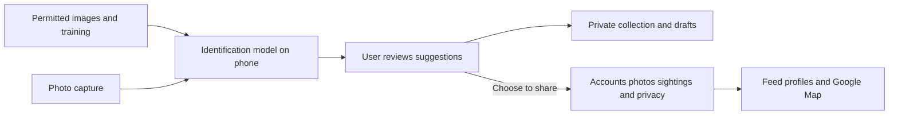

# Spotted

**A camera-first wildlife app for McMaster students and casual Hamilton walkers: capture a discovery, learn what it might be, and choose whether to share it.**

The feel is playful collecting with a calm map and a photo-led social feed. We will use Expo/React Native, begin prototyping in Expo Go, and use Google Maps. iPhone is the first supported platform; Android is deferred until the iPhone experience is stable. The app opens on the camera after a short first-use tutorial. Nearby discovery remains central through the Map tab.

## Four tabs with clear jobs

| Tab | Purpose | First version |
| --- | --- | --- |
| Feed | Enjoy other people's discoveries | Photo-led chronological local feed, captions, species suggestions and approximate areas. Proposed: appreciation reactions and saving posts, without public popularity scores. |
| Map | Find out what people have seen nearby | Google Maps with approximate sighting areas, time/species filters, a list alternative and a sighting preview. Historical records are a separate labeled layer. |
| Camera | Capture the moment | Default opening screen. Take or select a photo, crop/retake, request identification, then review before saving or sharing. |
| Wildlife | Learn and build your collection | My Discoveries and a small local field guide. Species pages show your encounters, identification tips and personal milestone badges. |

A profile/avatar opens your public photo grid, account settings, privacy controls and drafts. It does not need another tab. Followed accounts and comments are possible additions; direct messaging is outside the first version.

The references describe a feel: Snapchat's immediate camera access and VSCO's emphasis on photographs. Spotted's interaction is built around wildlife observations, not copying either app's full feature set.

## First-use tutorial and main journey

Keep the tutorial short and skippable: **Capture → Learn → Choose what to share.** Show that identification is a suggestion and that public locations are approximate. Ask for camera access when entering the camera, location when using nearby sightings or adding a location, and photo access when selecting an image. If permission is declined, browsing and manual area selection still work. Account creation can wait until a user wants to share.

The main journey is **photo → suggested species → review → save privately or publish**. Low confidence offers a retake, a broader label or an unidentified entry. Nothing posts automatically. Private discoveries count toward collection milestones too; users do not need to share to progress.

Badges celebrate a first discovery or several different supported species. No leaderboards, rarity bonuses, follower competitions or streak penalties. Seasonal challenges can follow the core experience. Corrected identifications and duplicate photos must not produce false collection progress.

## What good frontend means here

Use large photos, restrained nature-inspired colours, readable text and consistent controls. Let the camera and photography lead; keep map overlays quiet. A subtle animation can celebrate a discovery without interrupting the next action.

Design the whole experience, including denied permissions, an empty local feed, uncertain identification, failed uploads and offline drafts. Preserve an unfinished photo when switching tabs, pause the camera when it is not visible, and show which entries are private, queued or shared. These details matter more than adding extra tabs.

## How the system fits together

**Machine learning (ML)** learns from labeled photographs. We adapt an existing image model to a small set of familiar local birds and mammals. **On-device inference** means the phone runs that trained model; training happens separately on a development computer. Exact species depend on usable data and field testing.

The **backend** is the shared service storing accounts, photos and sightings. Google Maps supplies the base map; our backend supplies wildlife posts. Private drafts should work offline. Sharing needs a connection and must recover without creating duplicate posts. Offline identification remains a target to prove on an actual phone, not a benefit we claim from an online prototype.

Expo Go is the starting preview app, not a permanent technical constraint. `expo-camera` and `react-native-maps` support early prototypes. Plan an Expo development build—a test installation containing our chosen native libraries—for model integration and actual Google Maps configuration. Validate Google Maps and the chosen ML runtime on a physical iPhone early, including the development-build installation path. Record the test iPhone model and iOS version. Do not substitute `expo-maps` assuming equivalent Expo Go or iOS Google Maps support. [Technical sources](course-requirements.md#expo-and-google-maps).

Use React Native with TypeScript, Expo Router for navigation, and Google Maps through `react-native-maps`. Backend provider and ML runtime remain decisions for the two groups after a small compatibility test. Do not add a separate website.

## Two groups

| Group | Shared responsibility |
| --- | --- |
| **App and product — 4 people, including you** | Frontend, tutorial, camera journey, social features, Google Map, backend, privacy, release and demo experience. You also coordinate scrum with Codex assistance. |
| **Identification and data — 3 people** | Species/data selection, licensing, model training, phone-ready model delivery, field-guide content and performance evaluation. |

Assume equal skill and competence. Each group divides its own work; this document does not assign individual jobs. Both contribute to testing, documentation and videos. Integrate weekly, and rebalance when needed.

Agree early on the handoff: a photo goes in; species suggestions or an unknown result come out, with a stable species identifier and model version. The app group connects the model; the identification group supports integration and explains its limits. Initially, clearly labeled sample responses let app work proceed without waiting for training. They never count as working ML evidence.

## Build in this order

1. **Design the journey:** wireframe the tutorial, four tabs and capture-to-share flow. Choose typography/colours and one complete visual example. Walk through it with a few target users.
2. **Make it feel real in Expo Go:** camera, navigation, local drafts and sample feed/map/collection content. Check Google Maps on the available phones. In parallel, test a small model/data sample and its phone runtime.
3. **Connect one complete discovery:** a real photo gets a real suggestion, saves privately, then optionally becomes a protected post visible on a second phone. Move to a development build when native integration requires it.
4. **Complete the product:** accounts, photo profiles, basic badges, filtering, reporting/deletion, offline recovery and field-guide content. Add richer social interaction only after the main flow works.
5. **Validate and present:** independent field photos, device performance, privacy tests, new-user walkthroughs and an installable staff demo. Use a separate demo dataset for printed-animal photos.

| Course checkpoint | Evidence |
| --- | --- |
| Sep 21 selection; Sep 28 topic freeze | Clear scope, group ownership, permitted sample data and device feasibility |
| Oct 9 requirements and plan | Agreed journeys, model baseline, numerical acceptance targets and schedule |
| Nov 23 proof of concept | Real capture-to-identification-to-map flow; two-minute video, upload planned Nov 22 |
| Jan 25 design and testing | Integrated app, model evaluation, privacy and offline tests |
| Apr 5 final; EXPO date TBD | Tested release, real sightings, user guide, measured results, video and poster |

Book two instructor reviews and one TA deep dive per semester. The [course reference](course-requirements.md) retains submission details.

## Boundaries and evidence

Approximate pins suit common wildlife; sensitive sightings may need park-level summaries, delay or suppression. Apply protection on the backend, strip embedded photo coordinates, preserve imported location uncertainty and provide preview/deletion/reporting. Photos containing identifiable bystanders need review and crop/removal options. The map describes reported sightings, not animal abundance. Historical records keep their original dates and sources.

Test per-species accuracy, confidently wrong predictions, unfamiliar/non-animal photos, model size and response time on named devices. Keep independent test observations separate from training. Check app usability, private-location leakage and upload recovery too.

Seek already offers identification and badges; iNaturalist provides shared observations; Merlin supports bird discovery. Our proposed distinction is a welcoming camera-to-community experience for local walkers, with personal collecting and responsible sharing. Validate it with users rather than claim these individual features are new. [Research notes](course-requirements.md#spotted-research-notes).

Open decisions: available test iPhone and iOS version, exact species, backend/model runtime, identification review rules, and whether following/comments belong in the first release. P1 is the complete capture, identification, collection and protected sharing experience; seasonal challenges are P3. No implementation or measured performance exists yet.

Version 0.8, 17 September 2026: selected iPhone first, with Android deferred. Version 0.7: camera-first Expo/Google Maps direction, four-tab proposal and two self-organizing groups; user belongs to the group of four. Versions 0.3–0.6 established Spotted, audience, wildlife scope and noncompetitive personality. User supplied the direction; Codex researched and drafted. Human review pending. Internal overview, not a submission template.
