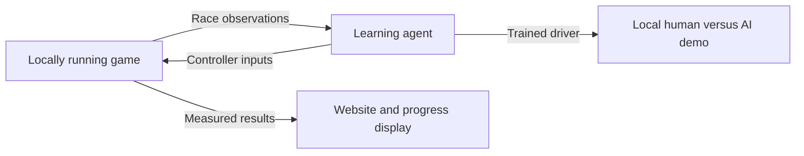

# Mario Kart 64 learning agent

We will teach an AI driver to race in Mario Kart 64, show how it improves, and let visitors race against it. Three people build the training system and agent. Four build the website and playable demo, and produce the course videos.

## How it works

**Reinforcement learning (RL)** means learning through trial and error. The agent observes the race, chooses controls, and receives rewards for useful behavior such as making progress. Repeating this process should produce a better driver. We judge improvement by completed races and race times, not just its training reward.

Training needs many attempts. **Native recompilation** translates the game’s instructions into code a modern computer can run. N64Recomp is a tool for that translation; it does not automatically provide a working training system. We still need to start races, control inputs and advance the game reliably.

During training, we aim to run **headless**: without drawing the screen or playing audio. This may let us generate experience faster. We must first prove that it works correctly and is meaningfully faster than real time. **Deterministic** means the same starting conditions and inputs reproduce the same outcome on the tested setup.

The game and training run locally. The public website presents the project and its results. At the booth, a local demo connects a human controller and the trained agent to the same race. Browser-based game streaming would be separate scope.

## What goes on the website

| Area | What visitors can do | What we build |
| --- | --- | --- |
| Meet the agent | Understand the idea and watch a short demonstration | Clear introduction and a simple explanation of learning through practice |
| Training progress | See whether the agent actually improves | Charts of race completion and lap times, with dated agent versions and labeled replay clips |
| Compare drivers | Compare an early agent, current agent and simple baseline | Selectable results showing track, race settings, sample count and failures |
| Race the agent | Find booth instructions or set up the local demo | Setup guide, supported hardware, controller instructions and troubleshooting |

Start with saved, verified results that the website loads. Live training updates and a grid of races are optional once the basic experience works. A small local results file is enough initially; the website does not need to control training.

The booth interface adds race selection, controller status, start/restart and results. It can share the website’s visual design while running locally. A public visitor cannot start a race on the booth computer through the website.

## Seven people in two groups

These are proposed ownership areas; names and strengths still need assigning. Both groups contribute to testing and documents.

| Person | Main responsibility |
| --- | --- |
| You | Agent training and experiment choices, plus scrum coordination with Codex support |
| Person 2 | Make the game run fast and reliably for training; connect game state and controls to the agent |
| Person 3 | Training implementation, repeatable evaluation and comparing agent versions |
| Person 4 | Website layout, explanations and accessible navigation |
| Person 5 | Results integration, progress charts and driver comparisons |
| Person 6 | Playable demo, controllers, race controls and recovery when something fails |
| Person 7 | Demo setup and usability testing, replay/video capture, course videos and user guide |

All three agent-group members work on learning, but the environment must work first. Person 2 should pair with the other two on that initial dependency. The four-person product group owns working software and its presentation: videos alone would leave too little technical ownership for a full-year project. Person 7 therefore also owns setup and test automation for the demo.

The groups agree on two shared outputs: a trained agent the demo can load, and a results file the website can display. Each includes the agent version and supported race settings. Integrate weekly so the website reflects actual progress. Early mock data must be clearly labeled and replaced before demonstrating results.

## Phases and course check-ins

| When | Agent group shows | Website and demo group shows |
| --- | --- | --- |
| Sep 21 selection; Sep 27 internal feasibility decision | Evidence that the game can advance reliably and faster than real time, or a clear blocker | Website outline and a credible local race/setup plan |
| Oct 9 requirements and plan | Agreed training scope and success measures | Agreed website/demo journeys and ownership |
| Nov 23 proof of concept | Working game control and an agent rollout | First real results on the site and a two-minute video showing working code; plan upload Nov 22 |
| Jan 25 design and testing document | Training progress and repeatable tests | Connected results display, demo integration and usability tests |
| Apr 5 final submission and video | Evaluated agent, reproducible results and usable installation | Finished website, human-versus-agent race, user guide, final video and poster |
| EXPO, date TBD | Frozen agent ready to race | Reliable booth setup and recovery procedure |

Book two instructor reviews and at least one TA deep dive per semester. Bring a working demonstration, measured progress and the next decision. You coordinate priorities and blockers; owners remain responsible for their components. Record actual meeting attendance in `meetings/`.

## Scope and success

**Required (P1):** reliable game control, a trained single-agent driver, repeatable evaluation, a website showing real results, and a working human-versus-agent demo. Measure simulation speed, repeated-run consistency, race completion, race time and demo reliability. Set numerical targets after the initial experiment, before the requirements submission.

**Later:** multiple learning agents racing with items (P2), a live race grid and leaderboard (P3). P0 means a blocking failure; P4 records future ideas. Optional work must not delay the required system.

Users provide a legally obtained game ROM, meaning their local game file. We do not supply ROMs, extracted assets or derived game data. Agree with the advisor what results/recordings can be published and how staff can run the demo without manual compilation. Local generation alone does not settle publication or licensing questions.

The topic freezes **September 28**. If the native approach cannot be demonstrated by September 27, discuss scope with the instructor before committing. Hardware, ROM access, teammate names and official submission templates remain open. No performance or learning results have been measured yet.

## Sources and revisions

[Course requirements and technical references](course-requirements.md) provide the supporting sources. This is a project overview, not an official submission template.

Version 0.2: replaced the detailed plan and slide deck with this overview; adopted the user’s three-person agent group and four-person website/demo group. Version 0.1 established the initial concept. User: idea, team split and scope feedback. OpenAI Codex: source review and drafting. Human review and named contributor assignments remain pending.
